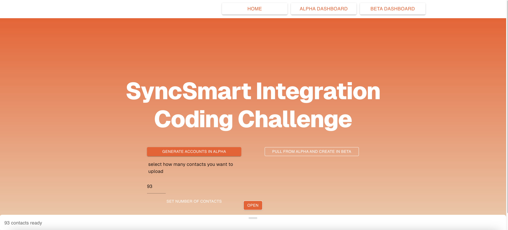

# SyncSmart Data Integration Coding Challenge

## 📊 Project Overview

This project is a simple yet powerful HubSpot Integration Tool that demonstrates how to generate fake contact data, send it to one HubSpot portal (Account A), and then pull and transfer that data to another HubSpot portal (Account B). It simulates a real-world CRM data sync operation and showcases skills in API integration, data handling, and UI responsiveness.

The core functionality was developed as part of a coding challenge to highlight efficiency, problem-solving, and user-focused design using modern development tools.

## 🔁Project MVP – Data Transfer Between Portals

Description:
The core functionality of this app allows users to generate fake contact information, send that data to HubSpot Account A, and then pull the same data from Account A and send it to Account B. This is achieved by transforming data from faker.js, storing it in app context, and sending the transformed data through a mutation POST request to the API endpoint (authenticated with the portal PAT). The portal accepts the data, and it is displayed as intended.

To transfer data to Account B, I chain a query and a mutation — first querying the necessary data from Account A, ensuring it’s correctly shaped, then triggering a mutation to send that data to Account B. I also designed a fallback feature: if a batch fails (e.g., due to duplicate contacts), a `for...of` loop sends individual POST requests for each contact. The result is a count of successful vs. failed contacts.

Upon accomplishing the base requirements, I was excited to test myself by diving into the T3 stack.

## 🔢 Select How Many Contacts to Send to Alpha

A user can choose how many contacts to send to the alpha portal. The default is 100, and that data is processed and run on the initial render of the site. To confirm the amount, users must click the “Set” button — a green check appears once confirmed.

## 🚫 Contact Removal Before Sending

Users can remove specific contacts from the batch via a slide-up table showing pending contacts (first name, last name, email, phone number, and index). To efficiently handle inclusion/exclusion, I used a Set (stored in context as a ref) to track indices of contacts to exclude.

Why a Set?
	1.	Ensures unique values.
	2.	O(1) add/delete performance.
	3.	Simplifies logic for removal.

When confirming contacts to remove, I reset the Set via a new instance. I also maintained a count state variable to keep UI in sync, as .size alone caused issues.

To track selection state, I used the Material UI row element’s value. One challenge I couldn’t resolve was handling “select all” from the header checkbox — due to MUI deprecating the control for that. A creative workaround is needed.

## ⚠️ Fallback Optimization (Single POSTs on Conflict)

When a batch POST fails, I catch specific errors (BATCH_ERROR, CONFLICT) and fallback to individual POSTs. While functional, this is slower and could be improved. Future work includes optimizing fallback performance and displaying progress in real-time so users understand what’s happening and the expected time.

## 📋 Portal Dashboards

There are two dashboards synced with the actual HubSpot test portals. Users can verify contact mutations without leaving the app. The dashboards render a table of contacts using a query function that requires a refetch() to trigger — ensuring it only runs when needed (e.g., on page visit). One optimization would be moving this state to context to avoid redundant fetches.

## ✅ Summary

I gained valuable experience working with Next.js and tRPC, and appreciated the benefits they offer, especially for developer experience (DX) once familiar with the stack. Below are features I plan to revisit to improve the application.

### 🛠️ Planned Features

#### ⏳ Loading States & UI Feedback

Currently, loading states are simple — button text changes and a Skeleton shows during fetches. However, using the same mutation function across multiple buttons causes shared loading state issues. I aimed for modular code, so this area could use refinement.

⸻

#### 🔐 OAuth Integration

I plan to implement OAuth to allow users to use their own HubSpot portals securely. For this challenge, I used a Personal Access Token (PAT) to focus on core functionality.

⸻

#### 🎨 Smooth UI Animations

Subtle animations would enhance UX and add polish to the interface.

⸻

### Connect with Me

[LinkedIn](https://www.linkedin.com/in/cassius-reynolds/)
